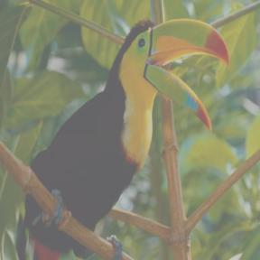
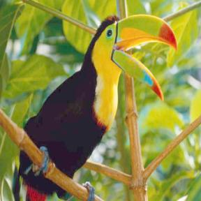
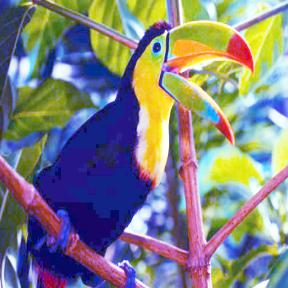
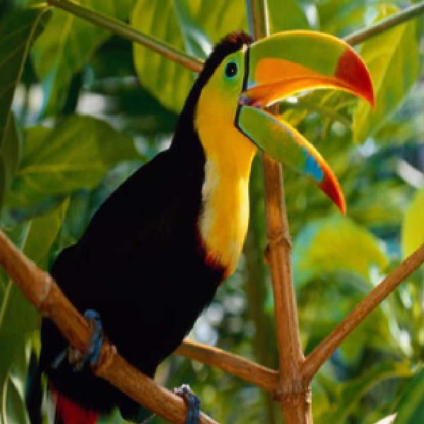
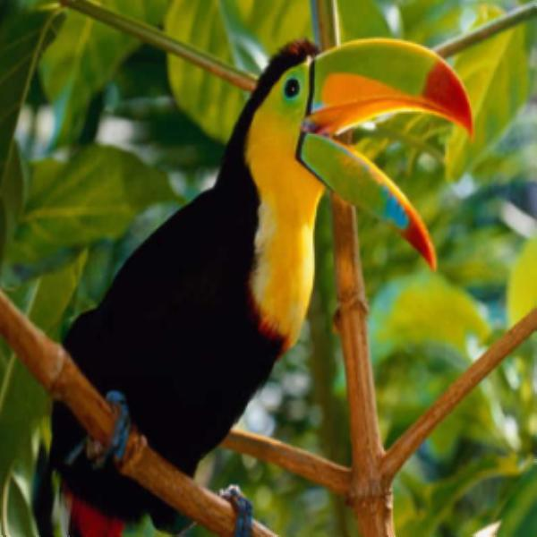
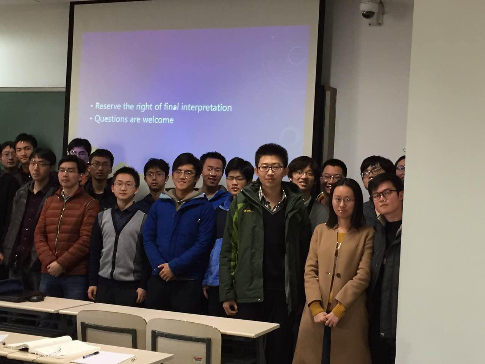
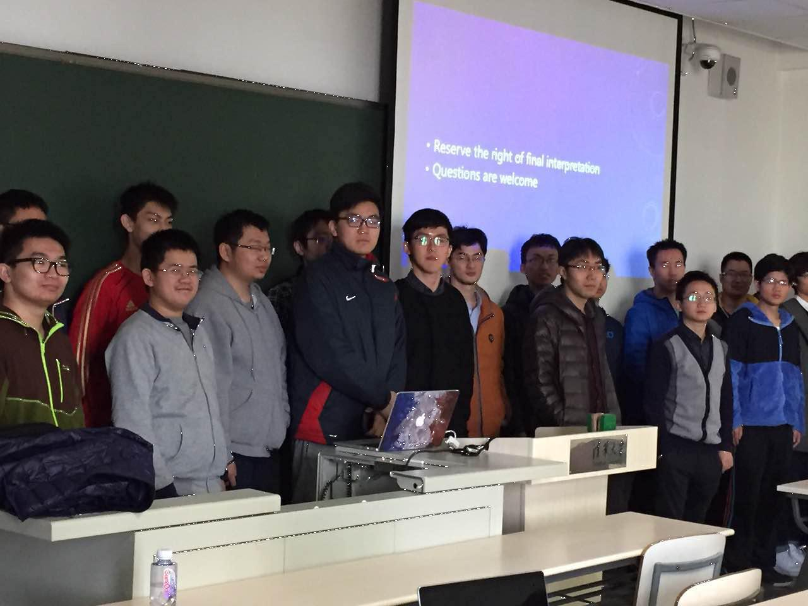
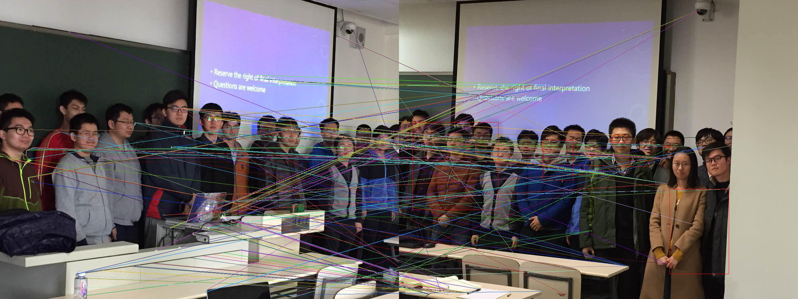

# 数字图像处理大作业报告
2014011333 丁铭
作业中使用了python 的PIL库进行图像IO，在最后可视化时调用了PIL库中画直线的部分标记结果，未使用其他库。
## 点处理
### 改变亮度
```
def changeBrightness(img, inc):
    ret = img.copy()
    for i in range(img.size[0]):
        for j in range(img.size[1]):
            (r,g,b) = img.getpixel((i,j))
            r1 = max(min(255, r + inc),0)
            g1 = max(min(255, g + inc),0)
            b1 = max(min(255, b + inc),0)
            ret.putpixel((i,j), (r1, g1, b1))
    return ret    
```
增加亮度80，
### 改变对比度
```
def changeContrast(img, alpha):
    ret = img.copy()
    for i in range(img.size[0]):
        for j in range(img.size[1]):
            (r,g,b) = img.getpixel((i,j))
            r1 = int(round(max(min(255, (r - 127) * alpha + 127),0)))
            g1 = int(round(max(min(255, (g - 127) * alpha + 127),0)))
            b1 = int(round(max(min(255, (b - 127) * alpha + 127),0)))
            ret.putpixel((i,j), (r1, g1, b1))
    return ret  
```
增大对比度，效果

###对比度拉伸
```
def contrastStretch(img, m1, m2):
    n1 = [255, 255, 255]
    n2 = [0, 0, 0]
    for i in range(img.size[0]):
        for j in range(img.size[1]):
            pix = img.getpixel((i,j))
            for k in range(3):
                if pix[k] < n1[k]:
                    n1[k] = pix[k]
                if pix[k] > n2[k]:
                    n2[k] = pix[k]
    ret = img.copy()
    for i in range(img.size[0]):
        for j in range(img.size[1]):
            pix = img.getpixel((i,j))
            pix2 = [0, 0, 0]
            for k in range(3):
                pix2[k] = (m2[k] - m1[k]) * (pix[k] - n1[k]) * 1.0 / (n2[k] - n1[k]) + m1[k]
                pix2[k] = int(round(pix2[k]))
            ret.putpixel((i,j), tuple(pix2))
    return ret
```
对比度拉伸到[100,200]区间，效果
###Gamma值变动
```
def gamma(img, ga):
    ret = img.copy()
    for i in range(img.size[0]):
        for j in range(img.size[1]):
            (r,g,b) = img.getpixel((i,j))
            r1 = int(round(255 * math.pow(r / 255.0, 1.0 / ga)))
            g1 = int(round(255 * math.pow(g / 255.0, 1.0 / ga)))
            b1 = int(round(255 * math.pow(b / 255.0, 1.0 / ga)))
            ret.putpixel((i,j), (r1, g1, b1))
    return ret   
```
Gamma变为2倍，效果
###直方图均值化
``` 
def histogramEqualization(img, m1, m2, d = [0, 1, 2]):
    '''
        d is the channels to be equalized
    '''
    ret = img.copy()
    p = cummulativeHistogram(img)
    for i in range(img.size[0]):
        for j in range(img.size[1]):
            pix = img.getpixel((i,j))
            pix2 = list(pix)
            for k in d:
                pix2[k] = (m2[k] - m1[k]) * p[k][pix[k]] + m1[k]
                pix2[k] = int(round(pix2[k]))
            ret.putpixel((i,j), tuple(pix2))
    return ret
```
这里展示三个色道一起均值化的结果，也支持选择其中若干个。
中间用到的`cummulativeHistogram`函数是自己完成的计算累计直方图的函数。
效果
### 直方图匹配
```
def histogramMatch(img1, img2, d = [0,1,2]):
    p1 = cummulativeHistogram(img1)
    p2 = cummulativeHistogram(img2)
    for k in d:
        p2_idx = 0
        for i in range(256):
            while p1[k][i] >= p2[k][p2_idx] and p2_idx < 255:
                p2_idx += 1
            p1[k][i] = p2_idx
    ret = img1.copy()
    for i in range(img1.size[0]):
        for j in range(img1.size[1]):
            pix = img1.getpixel((i,j))
            pix2 = list(pix)
            for k in d:
                pix2[k] = p1[k][pix[k]]
            ret.putpixel((i, j), tuple(pix2))
    return ret
```
由于没有合适的匹配图像，效果略去。不过通过对前面变换生成图像再匹配回去，验证结果应该是对的。

##图像放缩
###最近邻方法
```
def nearestNeibor(img, to_size):
    ret = Image.new(img.mode, to_size)
    sr = img.size[0] * 1.0 / to_size[0] if img.size[0] > to_size[0] else (img.size[0] - 1.0) / to_size[0]
    sc = img.size[1] * 1.0 / to_size[1] if img.size[1] > to_size[1] else (img.size[1] - 1.0) / to_size[1]
    for i in range(to_size[0]):
        for j in range(to_size[1]):
            ret.putpixel((i,j), img.getpixel((round(i * sr), round(j * sc))))
    return ret
```
缩放图像分别如下：
放大
缩小
###双线性差值
代码较长，略去
缩放图像分别如下：
放大
缩小
###bicubic
按照课件上的公式，我并不能得到正确的结果，推测是课件公式有误或理解不当，我使用了wiki上的bicubic公式：

缩放图像分别如下：
放大
缩小
####PSNR
计算时将图像缩为原来的1/4。此时计算得到的三种方法的PSNR分别为：

|Method        |PSNR           |
----|------|----
| nearestNeibor | 21.1333181634 |
| bilinear      | 29.7264689793 |
| bicubic       | 29.505136723  |

##Forgery Detection
总体思路使用了**特征点检测-描述子-匹配-聚类**的思路，找出第一张图片中未被匹配的特征值块，认为是消失的物体。
###特征点检测
这里没有使用传统的SIFT或者SURF等方法，而是使用了后来提出的[**FAST特征点检测**](http://dl.acm.org/citation.cfm?id=2094478)的方法，速度更快。这里代码较长，可以参考`fast.py`。
白点为找到的特征点。
效果
效果
###特征描述子与匹配
特征描述子采用了2010年提出的[**BRIEF特征描述**](http://cvlabwww.epfl.ch/~lepetit/papers/calonder_eccv10.pdf)，这一一种基于二值的特征描述，鲁棒性强，但是缺点是对于旋转角度的不变性比较差，在15度以内效果比较好。

然而在我们的任务中，镜头的旋转属于**空间的旋转**，而SIFT等方法所说的旋转不变性是平面旋转，恐怕也难以取得很好的效果。另一方面，拍照的时候**人脸实际上都转向镜头**，但从人来看其实并没有大角度旋转，因此这里使用是合适。

这里在原论文的基础上做了一点改动，就是使用**多个brief描述子，并对匹配的Hamming距离取平均**，这样不匹配点的高斯分布方差减小，使得结果出错的可能性更小，但同时时间消耗增大。

这些可以在`brief.py`中找到。
###聚类
使用k-means对未匹配特征点进行聚类。并求出包围盒并标记。这些可以在`k-means.py`中找到。

注意这里需要去除**特征点特别少的类**和**盒内匹配点很多的类**。
效果
红框（比较细）中即消失的人，可以看出效果还是很不错的，几乎所有的人都被找到。
